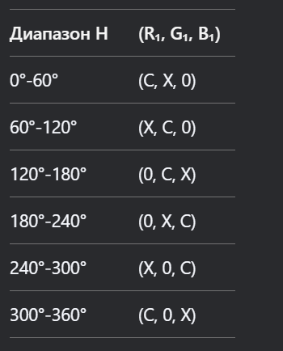

## 1. Опишите формат представления изображений в библиотеке OpenCv
**_Ответ:_** Изображение представляется в виде многомерного массива, в котором в зависимости от глубины и системы цветопередачи элементы принимают различные значения

## 2. Опишите принцип отображения окон в OpenCV
**_Ответ:_** OpenCV использует систему высокоуровневых окон для отображения изображений и видео. Она работает через внутренний GUI-бэкенд, который зависит от ОС, и предоставляет базовые функции управления окнами.

## 3. Каким образом возможно управлять параметрами отображения окон в OpenCV
**_Ответ:_** Управление параметрами окон осуществялется с помощью специальных флагов (enum) и методов таких, как создание (cv2.namedWindow()) или удаление (cv2.destroyWindow())

## 4. Какой класс отвечает за работу с видеопотоком?
**_Ответ:_** cv2.VideoCapture

## 5. Откуда возможно получение видеопотока?
**_Ответ:_** Видеопотоки можно получать с помощью указания пути к файлу или используя сетевые потоки

## 6. Каковы общие принципы работы с изображениями в потоке? Опишите понятие frame и принцип работы метода read()
**_Ответ:_** При использовании метода read() получаем кортеж (ret, frame), где ret - успешность получения кадра, а frame - сам кадр. Для показа видео необходимо работать в цикле так как по сути видео - это множество картинок, которые быстро показываются друг за другом

## 7. Что такое fourcc? Зачем применяется?
**_Ответ:_** fourcc - 4х байтовый код определяющий кодек видео (алгоритм сжатия). Используется для определения формата сжатия при записи в файл.

## 8. Опишите основные особенности класса video_writer?
**_Ответ:_** Предназначение запись видеопотока в файл, для этого ему необходимы: путь к файлу для записи, видеокодек, fps, размер кадра.

## 9. Что же значит эта проверка «cv2.waitKey(1) & 0xFF == 27»?
**_Ответ:_** cv2.waitKey(1) - ожидает нажатия клавиши в течении одной миллисекунды, затем побитовой маской получаем 8 бит и сравниваем с кодом клавиши escape

## 10. Объяснить, зачем применяется формат HSV, рассказать значения каждого из параметров, найти и указать формулы перевода из HSV в RGB и обратно. Объяснить геометрический смысл таких преобразований.
**_Ответ:_** HSV, более удобен в распознавании цветов, в отличии от BGR, так как в HSV такие слои как: H(hue) - угол цветового круга, S(saturation) — радиус на цветовом круге и V(value) - освещенность, разделены.

Формулы:

RGB -> HSV:

Находим максимум и мимнимум среди оттенков RGB: Cmin и Cmax
Если все цвета равны, то H=0, т.е. отенок не определен, иначе:

$$H=\begin{cases}
60^**(\frac{G-B}{Cmax-Cmin}),\text{ если }Cmax=R,\\
60^**(2+\frac{B-R}{Cmax-Cmin}), \text{ если }Cmax=G,\\
60^**(4+\frac{R-G}{Cmax-Cmin}), \text{ если }Cmax = B
\end{cases}
$$
$$S=\frac{Cmax-Cmin}{Cmax}$$
$$V=Cmax$$

HSV->RGB
Вычисляем промежуточные величины
```python
C = V × S          # Хроматическая составляющая
X = C × (1 - |(H/60) mod 2 - 1|)
m = V - C          # Минимальная компонента
```
Определяем базовые компоненты по секторам:


Добавляем яркость
```commandline
R = round((R₁ + m) × 255)
G = round((G₁ + m) × 255)
B = round((B₁ + m) × 255)
```

Геометрически HSV можно представить как цилиндр:
1. Hue — угол (цветовой круг), 
2. Saturation — радиус (чем ближе к центру, тем более "серый" цвет), 
3. Value — высота (освещённость).